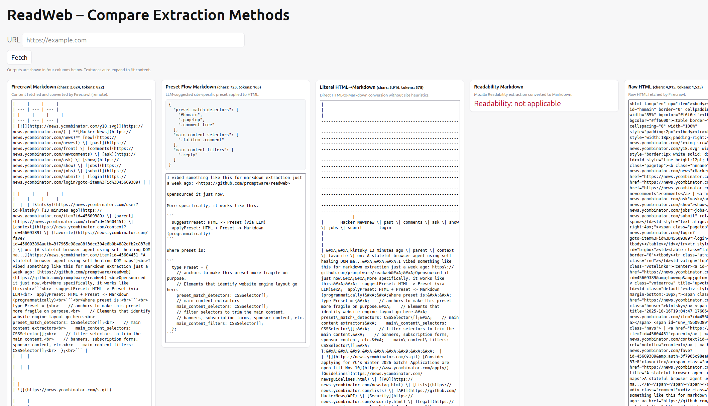

# Smart HTML → Markdown Scraper

A specialized pipeline for extracting **clean, token-efficient markdown** from websites.
Instead of dumping entire HTML pages into an LLM and wasting context on useless junk, this scraper zeroes in on the main content while stripping away everything else.

## Problem

Naive HTML -> Markdown conversion produces a ton of garbage that wastes tokens and pollutes LLM workflows. Typical noise includes:

- Navigation panels
- Popups
- Cookie consent banners
- Table of contents
- Headers / footers

## Solution

This project implements three pipelines:

1. Programmatic [mozilla/readability](https://github.com/mozilla/readability) (a.k.a. "reader mode") as HTML -> markdown API

2. ["Page preset" generation](src/presets/suggestPreset.ts): HTML -> Preset:

```typescript
type Preset = {
    // anchors to make this preset more fragile on purpose.
    // Elements that identify website engine layout go here.
    preset_match_detectors: CSSSelector[];
    // main content extractors
    main_content_selectors: CSSSelector[];
    // filter selectors to trim the main content.
    // banners, subscription forms, sponsor content
    main_content_filters: CSSSelector[];
};

type CSSSelector = string;
```

3. [Applying page preset](./src/presets/applyPreset.ts): Preset + HTML -> Markdown

## Try it

There is a vibed webserver page that implements a demo.

It compares these methods side by side:

- our preset generation flow
- Firecrawl URL -> markdown
- literal HTML -> markdown (similar to Firecrawl, but not exactly)
- Mozilla's Readability (reader mode)



1. Populate `.env` (see [.env.example](./.env.example)). Firecrawl is used for HTML fetching
2. `pnpm install`
3. `pnpm run start:web`
